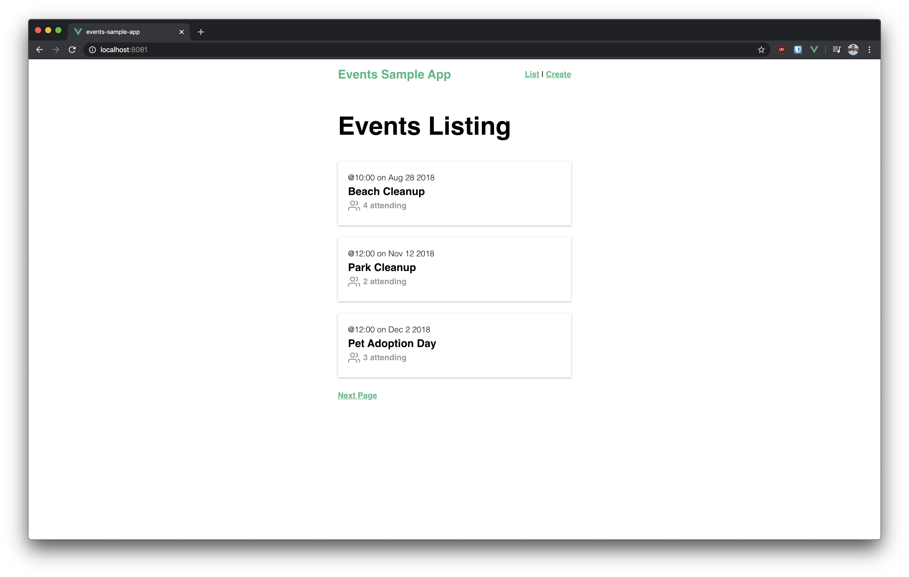

# Events Sample App

This is a sample events app made with Vue. It is made for the purposes of learning the framework more.



## Project Setup

To get started, install the all the dependencies from npm and
serve up the app locally.
```
npm install
npm run serve
```

Then, we can serve up our mock api server by using `json-server`.
```
npm install -g json-server
json-server --watch db.json
```
